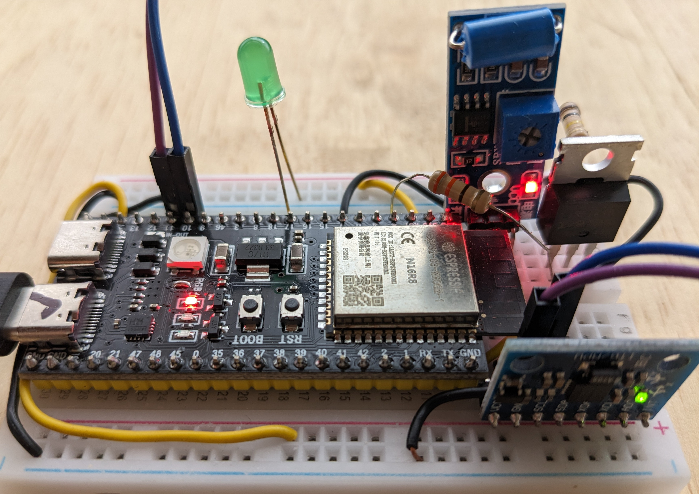

<!-- trunk-ignore-all(markdownlint/MD041) -->
### Accelerometer-Based Vibration Pattern Detection System

---

#### Overview
This project implements an accelerometer-based system to detect specific vibrations in trees, a phenomenon indicating potential threats to trees due to external mechanical forces, such as logging. It utilizes an ESP32 S3 microcontroller, Adafruit MPU6050 accelerometer, and SPIFFS filesystem for data storage.

---

#### Key Features
- **Accelerometer Sensing**: The system measures acceleration along three axes to detect tree shaking events.
- **Threshold Sensitivity**: Adjustable threshold values enable fine-tuning of sensitivity to detect shaking events, accounting for casing rigidity and full device weight values.
- **Data Logging**: Accelerometer data and computed work values are logged into a CSV file on the SPIFFS filesystem.
- **Alarm System**: An alarm is triggered if the detected shaking surpasses predefined thresholds, indicating potential threats to trees.
- **Low Power Mode**: The system utilizes low power modes to conserve energy when not actively sensing.

---

### Basic Flow:

    Interrupt on GPIO7 wakes up the device.
    The accelerometer will be powered on.
    The system will read data, then power off the accelerometer.
    GPIO7 will be re-enabled for future interrupts, and the system will enter deep sleep mode.

#### Components
- **[ESP32-S3](https://docs.espressif.com/projects/esp-idf/en/stable/esp32s3/hw-reference/esp32s3/user-guide-devkitc-1.html) | [Heltec V3](https://heltec.org/project/wifi-lora-32-v3/)**: Manages system operations, sensor interfacing, and data logging.
- **[GY-521 MPU6050](https://www.hotmcu.com/gy521-mpu6050-3axis-acceleration-gyroscope-6dof-module-p-83.html)**: Accelerometer sensor for measuring movements on the 3 axis.
- **[LM741 OpAmp setup](https://www.ti.com/lit/ds/symlink/lm741.pdf)**: Deals with generating clean interrupts at nA range of input offset current.
- **[SPIFFS Filesystem](https://docs.espressif.com/projects/esp-idf/en/stable/esp32/api-reference/storage/spiffs.html)**: Used for storing accelerometer data in CSV format.
- **LED Indicator**: Provides visual feedback, indicating system status and alarm activation.


---
#### Libraries

.ini file for the Heltec V3
```bash
[env:heltec_wifi_lora_32_V3]
platform = espressif32@6.8.1
board = heltec_wifi_lora_32_V3
framework = arduino
```
.ini file for the ESP32-S3 Devkit
```bash
[env:esp32_s3]
platform = espressif32
board = esp32_s3_devkitc
framework = arduino
```
---

### Prototyping

Here are some images of the current prototype:


*Front view of the prototype.*


*Side view of the prototype.*


### Pinout

#### [Heltec V3 Devkit](https://heltec.org/project/wifi-lora-32-v3/)

| Function                     | GPIO Number | Pin Description                |
|------------------------------|-------------|--------------------------------|
| **LED Pin**                  | 3           | Debugging LED                  |
| **Interrupt Pin**            | 7           | External Interrupt             |
| **Accelerometer Power Pin**  | 5           | Power control for accelerometer|
| **I2C SDA**                  | 41          | I2C Data (SDA)                 |
| **I2C SCL**                  | 42          | I2C Clock (SCL)                |
| **5V Input**                 | N/A         | 5V Power Input                 |
| **3.3V Input**               | N/A         | 3.3V Power Input               |
| **Vext Output**              | N/A         | 3.3V External Voltage Output   |


#### ESP32-S3 Devkit (code should work the same, just toggle [env:esp32_s3] )

| Function                     | GPIO Number | Pin Description                |
|------------------------------|-------------|--------------------------------|
| **LED Pin**                  | 17          | Debugging LED                  |
| **Interrupt Pin**            | 7           | External Interrupt             |
| **Accelerometer Power Pin**  | 4           | Power control for accelerometer|
| **I2C SDA**                  | 10          | I2C Data (SDA)                 |
| **I2C SCL**                  | 11          | I2C Clock (SCL)                |


### Setup and Operation

1. **Hardware Setup**: Connect the MPU6050 sensor over I2C. A simple diode scheme will disable the shake detector upon module's wakeup.

2. **Software Configuration**: Define threshold values and sampling duration in the code.

3. **Deployment**: Rigidity and weight of the enclosure matter. You'll need to hardcode the exact weight of your enclosure. Also, install the prototype onto the tree with a rigid device, such as PVC, so that vibrations in the trunk will move through the casing into the accelerometer.

4. **Operation**: The system continuously samples accelerometer data, logging it to the SPIFFS filesystem. If shaking surpasses predefined thresholds, an alarm is activated. No vibration will put the system into deep sleep. A simple IRFZ44N acts as an off switch for the shake detector while the accelerometer computes the vibration pattern. The LED does the alarm functionality indicating whether or not a logging is happening to the tree.

5. **Analysis**: Logged data can be used to identify shaking events and patterns and assess potential threats to trees.

6. **Maintenance**: Periodically check and maintain the system to ensure accurate monitoring and alarm functionality.

7. **Battery Life**: If you have a 2000 mAh battery and the Heltec V3 module's power consumption and usage scenario remain the same (100 mA during computation for 1 minute per day, and 10 µA in deep sleep), the calculations are as follows:

### 1. Estimate Daily Power Consumption

**Active Time**: 1 minute per day

- **Daily Active Consumption**:
  \[
  \text{Daily Active Consumption (mAh)} = \frac{100 \text{ mA} \times 60 \text{ seconds}}{3600 \text{ seconds/hour}} = \frac{6000}{3600} \approx 1.67 \text{ mAh/day}
  \]

**Deep Sleep Time**: 23 hours 59 minutes

- **Deep Sleep Time in Hours**: 23.983 hours
- **Daily Deep Sleep Consumption**:
  \[
  \text{Daily Deep Sleep Consumption (mAh)} = \frac{10 \text{ µA} \times 23.983 \text{ hours}}{1000} = \frac{239.83}{1000} \approx 0.24 \text{ mAh/day}
  \]

**Total Daily Consumption**:
  \[
  \text{Total Daily Consumption (mAh)} = 1.67 \text{ mAh} + 0.24 \text{ mAh} \approx 1.91 \text{ mAh/day}
  \]

### 2. Calculate Battery Life with a 2000 mAh Battery

**Total Consumption per Day**: 1.91 mAh

- **Battery Capacity**: 2000 mAh

**Daily Battery Life**:
  \[
  \text{Daily Battery Life (days)} = \frac{2000 \text{ mAh}}{1.91 \text{ mAh/day}} \approx 1047.12 \text{ days}
  \]

**Battery Life in Years**:
  \[
  \text{Battery Life (years)} = \frac{1047.12 \text{ days}}{365.25 \text{ days/year}} \approx 2.87 \text{ years}
  \]

So, with a 2000 mAh battery, the system would last approximately **2.87 years** under the given usage scenario.
---

#### License
This project is released under the [MIT License](LICENSE.md).

---

#### Author
Josep Navarro, UVERD ltd

---

#### Acknowledgments
- Adafruit Industries for the MPU6050 library.
- ESP32 Arduino Core developers for the development tools and libraries.

---
