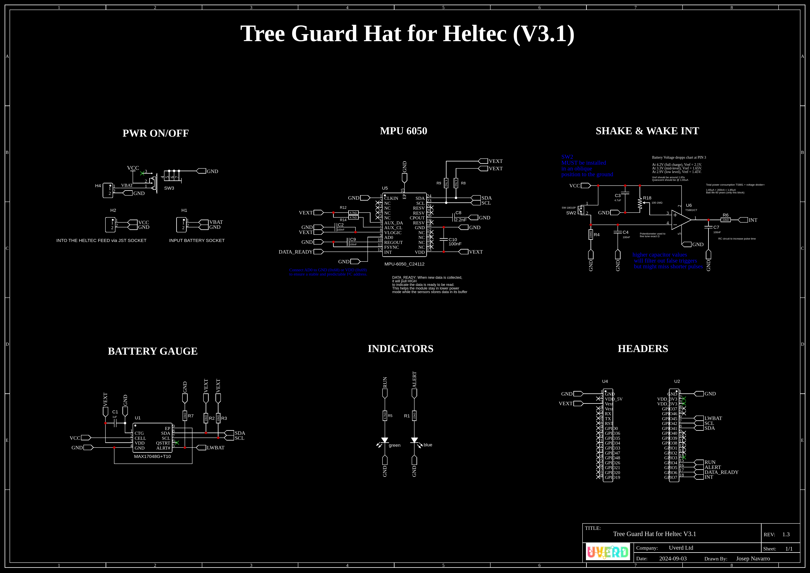
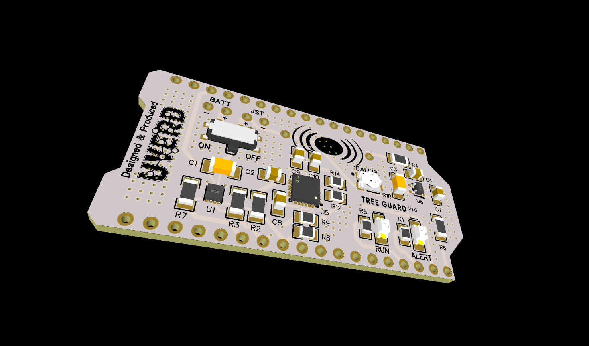
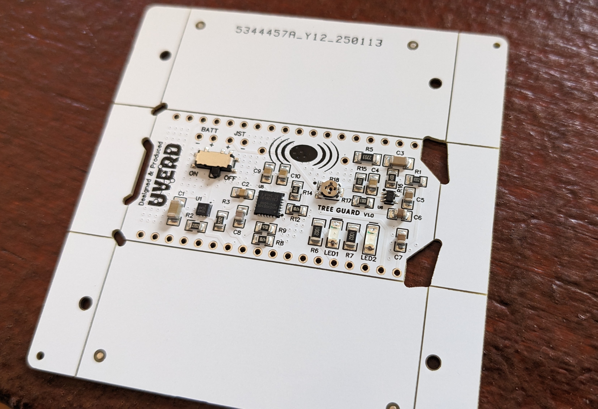

<!-- trunk-ignore-all(markdownlint/MD041) -->
### Real-time Vibration Pattern Recognition System.

---

### Overview
This project implements wavelet-based vibration analysis to classify specific events occurring on trees using an accelerometer. It can detect machete cuts, chainsaw operation, and ambient wind based on distinct vibration signatures. The system evaluates potential threats and sends alerts accordingly using real-time analysis. The firmware is Meshtastic-compatible and operates below 3μA when idle—; far more efficient than sound-based systems.The hardware features an ESP32-S3, MPU6050 accelerometer, TS881ICT nano-power opAmp.

---

### Key Features
- **Accelerometer Sensing**: The system measures acceleration along three axes to detect tree shaking events.
- **Wavelet Classification**: Real-time detection of vibration types (machete, chainsaw, or wind) using db4 wavelet decomposition and peak detection logic.

- **Threshold Sensitivity**: Adjustable threshold values enable fine-tuning of sensitivity to detect shaking events, accounting for casing rigidity and full device weight values.
- **Data Logging**: Accelerometer data and computed work values are logged into a CSV file on the SPIFFS filesystem.
- **Alarm System**: An alarm is triggered if the detected shaking surpasses predefined thresholds, indicating potential threats to trees.
- **Low Power Mode**: The system utilizes low power modes to conserve energy when not actively sensing.


### Basic Flow

    Interrupt wakes up the device. The interrupt is disabled.
    Accelerometer and battery gauge are powered on.
    System reads data stream,
    Evaluates the vibration waveform using wavelet energy bands and peak patterns to classify it into 3 categories.
    Decides whether to send an alarm or not.
    Battery levels are read and logged.
    Accelerometer and battery gauge are powered off.
    Interrupt is re-enabled for future interrupts.
    System enters deep sleep mode.

---

### Components
- **[Heltec V3](https://heltec.org/project/wifi-lora-32-v3/)** | **[ESP32-S3](https://docs.espressif.com/projects/esp-idf/en/stable/esp32s3/hw-reference/esp32s3/user-guide-devkitc-1.html)**: Manages system operations, sensor interfacing, and data logging.
- **[GY-521 MPU6050](https://www.hotmcu.com/gy521-mpu6050-3axis-acceleration-gyroscope-6dof-module-p-83.html)**: Accelerometer sensor for measuring movements on the 3 axis.
- **[MAX17048G+T10](https://www.mouser.com/datasheet/2/609/MAX17048_MAX17049-3469099.pdf)**: Micropower current lithium battery gauge with ±7.5mV precision.
- **[SW420 vibration sensor](https://www.researchgate.net/figure/a-The-SW420-vibration-sensor-b-the-mounting-position-of-the-SW420-vibration-sensor_fig3_362647463)**: Normally closed switch to wake up the module upon vibration.
- **[TS881ICT OpAmp & Comparator](https://www.st.com/en/amplifiers-and-comparators/ts881.html)**: Generates clean interrupts at nano power quiescent current.
- **[SPIFFS Filesystem](https://docs.espressif.com/projects/esp-idf/en/stable/esp32/api-reference/storage/spiffs.html)**: Used for low power, real-time analysis of accelerometer data.
- **LED Indicator**: For debugging and system status and alarm indication.


### Libraries

.ini file for the Heltec V3
```bash
[env:heltec_wifi_lora_32_V3]
platform = espressif32@6.8.1
board = heltec_wifi_lora_32_V3
framework = arduino
```
.ini file for generic ESP32-S3 Devkit
```bash
[env:esp32_s3]
platform = espressif32
board = esp32_s3_devkitc
framework = arduino
```
---

### Hardware


*Proof of concept using Heltec V3.1.*


*Hat Schematics.*


*Hat 3D view.*


*Hat PCB.*

### Pinout

#### [Heltec V3 Devkit](https://heltec.org/project/wifi-lora-32-v3/)

| Function                     | GPIO Number | Pin Description                |
|------------------------------|-------------|--------------------------------|
| **LED Pin**                  | 3           | Debugging LED (add 22KΩ)   |
| **Interrupt Pin**            | 7           | External Interrupt             |
| **Accelerometer Power Pin**  | 5           | Power control for accelerometer|
| **I2C SDA**                  | 41          | I2C Data (SDA)                 |
| **I2C SCL**                  | 42          | I2C Clock (SCL)                |
| **5V Input**                 | N/A         | 5V Power Input                 |
| **3.3V Input**               | N/A         | 3.3V Power Input               |
| **Vext Output**              | N/A         | 3.3V External Voltage Output   |


#### [ESP32-S3 generic Devkit](https://docs.espressif.com/projects/esp-dev-kits/en/latest/esp32s3/esp32-s3-devkitc-1/user_guide.html) 
*(code should work the same, just toggle [env:esp32_s3] )

| Function                     | GPIO Number | Pin Description                |
|------------------------------|-------------|--------------------------------|
| **LED Pin**                  | 17          | Debugging LED                  |
| **Interrupt Pin**            | 7           | External Interrupt             |
| **Accelerometer Power Pin**  | 4           | Power control for accelerometer|
| **I2C SDA**                  | 10          | I2C Data (SDA)                 |
| **I2C SCL**                  | 11          | I2C Clock (SCL)                |


### Setup and Operation

1. **Hardware Setup**: Connect the MPU6050 sensor over I2C. A simple diode scheme will disable the shake detector upon module's wakeup.

2. **Software Configuration**: Define threshold values and sampling duration in the code.

3. **Deployment**: Rigidity and weight of the enclosure matter. You'll need to hardcode the exact weight of your enclosure. Also, install the prototype onto the tree with a rigid enclosure, such as PVC, so that vibrations in the trunk will move through the casing into the accelerometer. Finally, the sw420 operates best when soldered to the pcb at an oblique angle.

4. **Operation**: When awake, the system continuously samples accelerometer data for a period of 60 seconds. If shaking surpasses predefined parameters, an alarm is activated. If no threats are found, the system goes into deep sleep. The ALARM led is used to manually calibrate (screw) the physical intensity at which the device will wake up. Crucial for field installation. When u are 8m up in the tree, you want to REALLY make sure that strikes to the trunk are noticed by the device!! The RUN led indicate the device is ON and it is disabled shortly after to conserve battery.

5. **Analysis**: Logged data to the SPIFFS memory is used to identify vibration patterns thru FFT analysis, and it will categorize which tools are being used, i.e. machete, hand saw or chainsaw. Useful for post analysis in certain scenarios.

6. **Battery Life**: The device is expected to last without charging for **@ 4 years**. Each time the system wakes up, it will send a message with the battery level for re-charge planning. The following is an arbitrary calculation in normal operation conditions.

---

### Battery Life Calculations (Example Scenario)


- 3 wake-ups of 60 seconds each per day
- 100 mA during computation (Heltec V3.1)
- 3 µA in deep sleep
- 8000 mAh battery


#### 1. Daily Power Consumption

- **Active Consumption (mAh)**:
  (100 mA × 60 seconds × 3) / 3600 seconds/hour = 18000 / 3600 = **5 mAh/day**

- **Deep Sleep Consumption (mAh)**:
  (3 µA × 23.95 hours) / 1000 = 71.85 / 1000 ≈ **0.072 mAh/day**

- **Total Daily Consumption**:
  5 mAh + 0.072 mAh ≈ **5.072 mAh/day**


#### 2. Battery Life with 8000 mAh Battery

- **Daily Battery Life**:
  8000 mAh / 5.072 mAh/day ≈ **1572.5 days** (~ **4.3 years**)

---


#### License
This project is released under the [MIT License](LICENSE.md).

---

#### Author
Josep Navarro, UVERD ltd

---

#### Acknowledgments
- Adafruit Industries for the MPU6050 library.
- ESP32 Arduino Core developers for the development tools and libraries.

---
