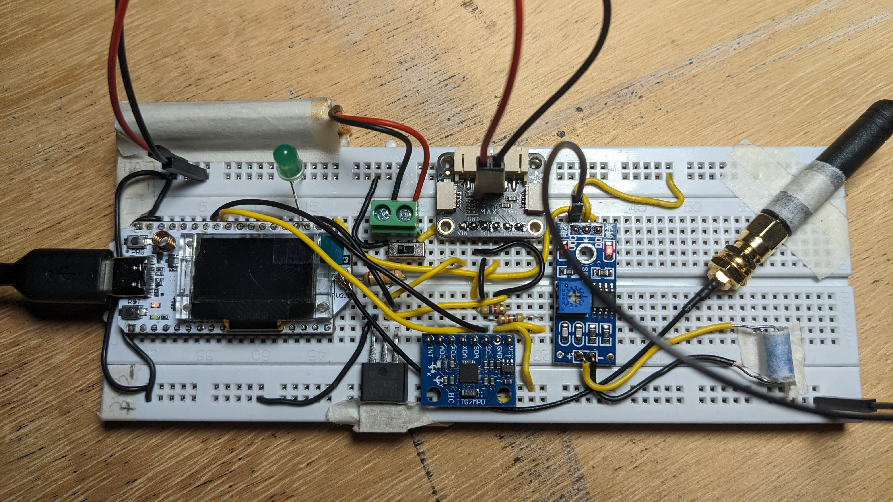
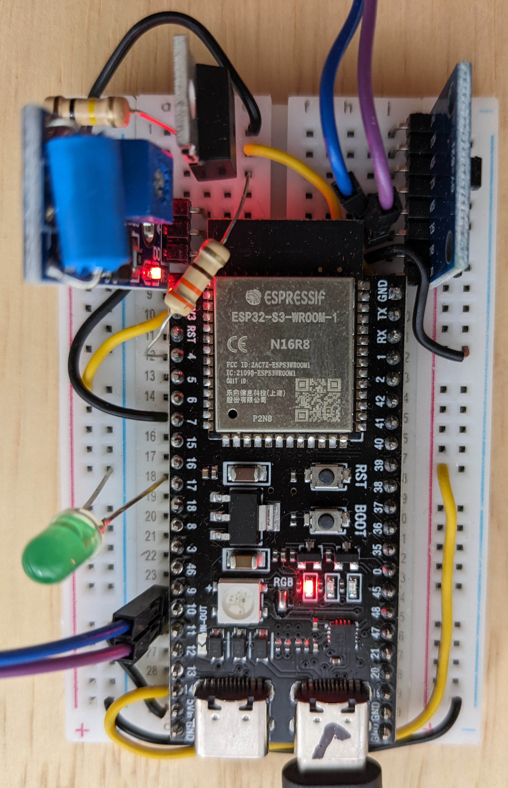

<!-- trunk-ignore-all(markdownlint/MD041) -->
### Accelerometer-Based Vibration Pattern Detection System

---

#### Overview
This project implements FFT (Fast Fourier Transform) to identify the dominant frequencies in a vibration sensor (accelerometer) to detect specific events occurring on trees. Catering only to patterns that could indicate continuous sharp spikes, like machete cuts, or slightly lower-frequency vibrations like a chainsaw or a handsaw. The system evaluates to indicate potential threats to trees and sends an alarm accordingly. The device is able to detect threats with minimal power consumption compared to strategies such as sound analysis. It utilizes an ESP32-S3 microcontroller, MPU6050 accelerometer, and SPIFFS filesystem for data storage.

---

#### Key Features
- **Accelerometer Sensing**: The system measures acceleration along three axes to detect tree shaking events.
- **Threshold Sensitivity**: Adjustable threshold values enable fine-tuning of sensitivity to detect shaking events, accounting for casing rigidity and full device weight values.
- **Data Logging**: Accelerometer data and computed work values are logged into a CSV file on the SPIFFS filesystem.
- **Alarm System**: An alarm is triggered if the detected shaking surpasses predefined thresholds, indicating potential threats to trees.
- **Low Power Mode**: The system utilizes low power modes to conserve energy when not actively sensing.

---

### Basic Flow

    Interrupt on GPIO7 wakes up the device. The interrupt is disabled.
    The accelerometer will be powered on.
    The system will read data, evaluate it and decide whether to send an alarm or not.
    Then power off the accelerometer.
    GPIO7 will be re-enabled for future interrupts, and the system will enter deep sleep mode.

#### Components
- **[ESP32-S3](https://docs.espressif.com/projects/esp-idf/en/stable/esp32s3/hw-reference/esp32s3/user-guide-devkitc-1.html) | [Heltec V3](https://heltec.org/project/wifi-lora-32-v3/)**: Manages system operations, sensor interfacing, and data logging.
- **[GY-521 MPU6050](https://www.hotmcu.com/gy521-mpu6050-3axis-acceleration-gyroscope-6dof-module-p-83.html)**: Accelerometer sensor for measuring movements on the 3 axis.
- **[SW18010P](https://www.amazon.com/Ganasome-Sensitivity-Vibration-Sensor-SW-18010P/dp/B0CYC2HGL3?crid=3E8NER9IKBTUJ&dib=eyJ2IjoiMSJ9.AXH0zARAFmoLteV3ZuiE7Qis7u6Ex6XUNmmETaQ9OSGE4xzvSVPofnLOiwQTrNdhWCYaBgQAM_0hm55n9m1Je-C0A9oHV8xSNCk5wG7kF-ofkmDYQoplpwZA5PnZPowccOO0kJ5uFqUSMTMsN4YcRwJ0LFeEVE-Im3yLu4L1t1F-4TJ-dtsBvzJmcsFGzvX9_pWyRS9vnloQw0DdHbz_WLBpEexOoX49zcR6ELPYG-xCJekZJrLgGeE4fxgZY3j-AIrCQHD2JDxp0Gg6rqZkj9dEfQ3TmXGdtDSGM6gDAqQwfJb7rB4kI-Q_7d9_0_obOZ9BC9damx-G8_lFYghI3EU1L-4MUlK89TjwoHVP5O4guyvgmJZCIlKHwRX5NLUh5qclbbmoXEjlWjilDeoxMBdlSdzVle-mOUIhTiKBwneMpCdeDpV8wDla3gu9UH2D.7Y5GzKfmtvDDlzjo3MiG56ZSvvcxMlVepYsldtGZCuM&dib_tag=se&keywords=sw18010p&qid=1736804313&sprefix=sw1801%2Caps%2C1252&sr=8-5)**: Accelerometer sensor for measuring movements on the 3 axis.
- **[LM741 OpAmp setup](https://www.ti.com/lit/ds/symlink/lm741.pdf)**: Deals with generating clean interrupts at nA range of input offset current.
- **[SPIFFS Filesystem](https://docs.espressif.com/projects/esp-idf/en/stable/esp32/api-reference/storage/spiffs.html)**: Used for storing accelerometer data in CSV format.
- **LED Indicator**: Provides visual feedback, indicating system status and alarm activation.


---
#### Libraries

.ini file for the Heltec V3
```bash
[env:heltec_wifi_lora_32_V3]
platform = espressif32@6.8.1
board = heltec_wifi_lora_32_V3
framework = arduino
```
.ini file for the ESP32-S3 Devkit
```bash
[env:esp32_s3]
platform = espressif32
board = esp32_s3_devkitc
framework = arduino
```
---

### Testing Setup


*Heltec V3 prototype.*


*ESP32 devkit prototype.*


### Pinout

#### [Heltec V3 Devkit](https://heltec.org/project/wifi-lora-32-v3/)

| Function                     | GPIO Number | Pin Description                |
|------------------------------|-------------|--------------------------------|
| **LED Pin**                  | 3           | Debugging LED (add 22KΩ)   |
| **Interrupt Pin**            | 7           | External Interrupt             |
| **Accelerometer Power Pin**  | 5           | Power control for accelerometer|
| **I2C SDA**                  | 41          | I2C Data (SDA)                 |
| **I2C SCL**                  | 42          | I2C Clock (SCL)                |
| **5V Input**                 | N/A         | 5V Power Input                 |
| **3.3V Input**               | N/A         | 3.3V Power Input               |
| **Vext Output**              | N/A         | 3.3V External Voltage Output   |


#### ESP32-S3 Devkit (code should work the same, just toggle [env:esp32_s3] )

| Function                     | GPIO Number | Pin Description                |
|------------------------------|-------------|--------------------------------|
| **LED Pin**                  | 17          | Debugging LED                  |
| **Interrupt Pin**            | 7           | External Interrupt             |
| **Accelerometer Power Pin**  | 4           | Power control for accelerometer|
| **I2C SDA**                  | 10          | I2C Data (SDA)                 |
| **I2C SCL**                  | 11          | I2C Clock (SCL)                |


### Setup and Operation

1. **Hardware Setup**: Connect the MPU6050 sensor over I2C. A simple diode scheme will disable the shake detector upon module's wakeup.

2. **Software Configuration**: Define threshold values and sampling duration in the code.

3. **Deployment**: Rigidity and weight of the enclosure matter. You'll need to hardcode the exact weight of your enclosure. Also, install the prototype onto the tree with a rigid device, such as PVC, so that vibrations in the trunk will move through the casing into the accelerometer.

4. **Operation**: The system continuously samples accelerometer data, logging it to the SPIFFS filesystem. If shaking surpasses predefined thresholds, an alarm is activated. No vibration will put the system into deep sleep during FFT analysis. The LED does the alarm functionality indicating whether or not a logging is happening to the tree.

5. **Analysis**: Logged data can be used to identify shaking events and patterns and assess potential threats to trees.

6. **Battery Life**: The following example is calculated for: 2000 mAh battery, Heltec V3.1. Usage scenario: 100 mA during computation for 1 minute per day, and 10 µA in deep sleep.

### 1. Estimate Daily Power Consumption

**Active Time**: 1 minute per day

- **Daily Active Consumption**:

  Daily Active Consumption (mAh) = (100 mA × 60 seconds) / 3600 seconds/hour = 6000 / 3600 ≈ 1.67 mAh/day

**Deep Sleep Time**: 23 hours 59 minutes

- **Deep Sleep Time in Hours**: 23.983 hours
- **Daily Deep Sleep Consumption**:

  Daily Deep Sleep Consumption (mAh) = (10 µA × 23.983 hours) / 1000 = 239.83 / 1000 ≈ 0.24 mAh/day

**Total Daily Consumption**:

  Total Daily Consumption (mAh) = 1.67 mAh + 0.24 mAh ≈ 1.91 mAh/day

---

### 2. Battery Life with a 2000 mAh Battery

**Total Consumption per Day**: 1.91 mAh

- **Battery Capacity**: 2000 mAh

**Daily Battery Life**:

  Daily Battery Life (days) = 2000 mAh / 1.91 mAh/day ≈ 1047.12 days

**Battery Life in Years**:

  Battery Life (years) = 1047.12 days / 365.25 days/year ≈ 2.87 years

---

So, with a 2000 mAh battery, the system would last approximately **2.87 years** under the given usage scenario.

---

#### License
This project is released under the [MIT License](LICENSE.md).

---

#### Author
Josep Navarro, UVERD ltd

---

#### Acknowledgments
- Adafruit Industries for the MPU6050 library.
- ESP32 Arduino Core developers for the development tools and libraries.

---
